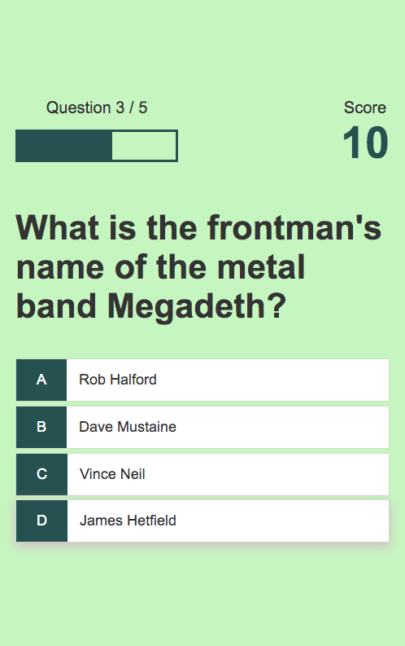

# openTriviaAPI_quiz

A simple music trivia quiz with the Open Trivia Database API!!!!!

**Link to project:** https://alia-opentriviadb-quiz.netlify.com/

## How It's Made:

**Tech used:** HTML5, CSS3, ES6, Fetch API, localStorage, array methods

Using **ES6**, I created a simple Beyonce trivia quiz application with clean code. The question/answer bank were saved in a **JSON** file, and pulled using the **fetch API**. The quiz has multiple views: a home page, a scoreboard, and the actual quiz questions. Makes use of **clean UI**, **semantic HTML5**, and **CSS3** for an efficient user experience. I used a CSS3 keyframe animation for the first time!!!!!! The high scores are saved in **localStorage** and 5 are displayed at a time on the scoreboard. The latest high scores are always shown, using the **sort() method to sort them in descending order** and the **splice() method** to cut off scores as new high scores are made. 

## Optimizations

If I were to make changes in this application, I would definitely store highest score/scoreboard information on the server instead of using localStorage. Though localStorage was efficient, considering this was a front-end project, business logic is generally best executed on the server so that nobody can cheat using the console.

I also did this same project with my own questions and answers, being fetched from a JSON file: https://github.com/aliaabdulahi/JSON_quiz

## Lessons Learned:

I learned a very simple and clean way to use the sort() method in a real-world application AND how to fetch data from an API to use in an internal application. I also learned how to make a loader using CSS3 keyframe animations!!!!!!

## Examples:
Take a look at these couple examples of vanilla JavaScript efficiency that I have in my own portfolio:

**Check out this same quiz with my own data being fetched from JSON:** https://github.com/aliaabdulahi/openTriviaAPI_quiz

**Object-Oriented Library Assister:**  https://github.com/aliaabdulahi/OOP-Library-Assister

**:** 
